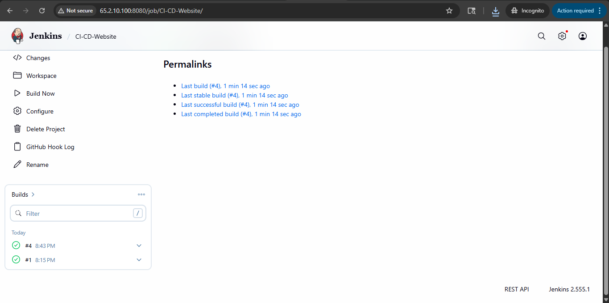
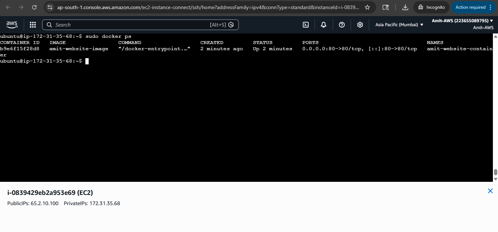
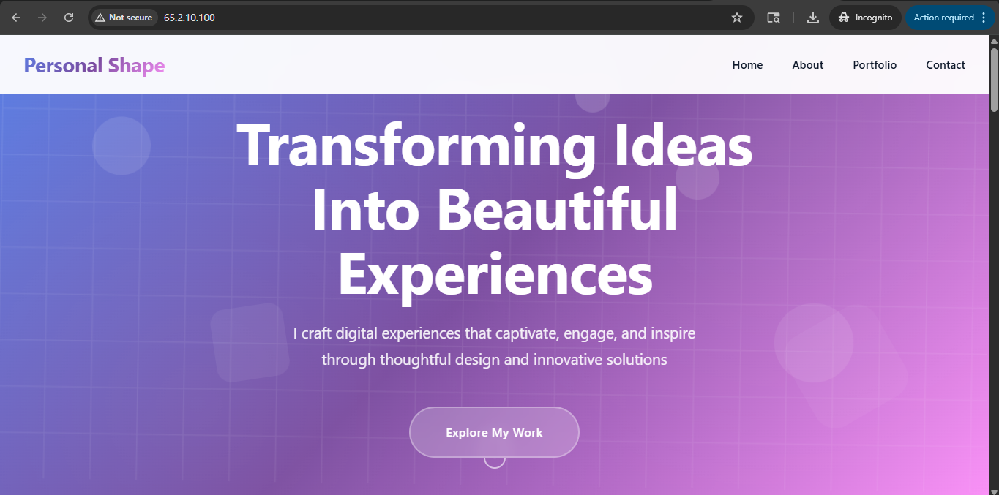
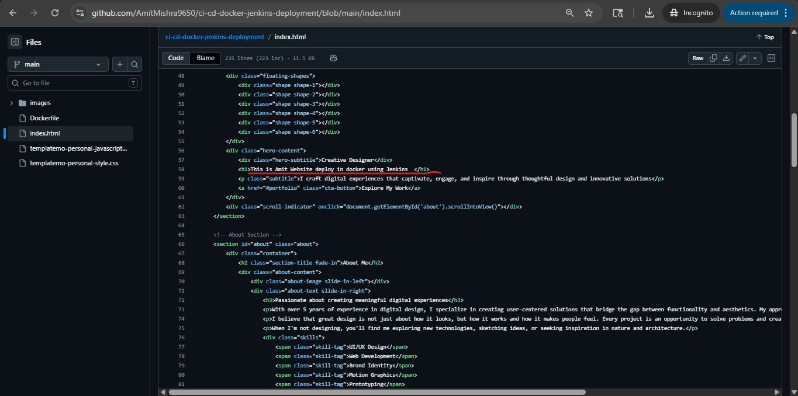
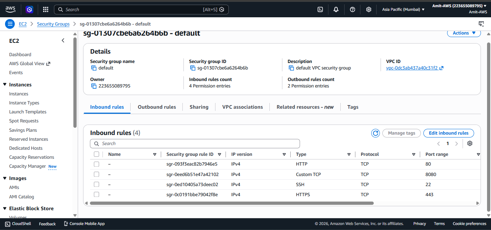
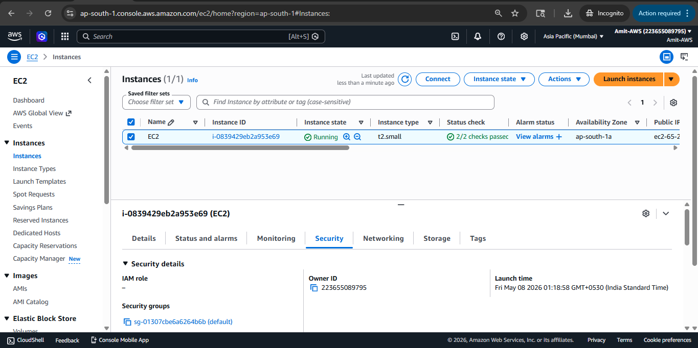
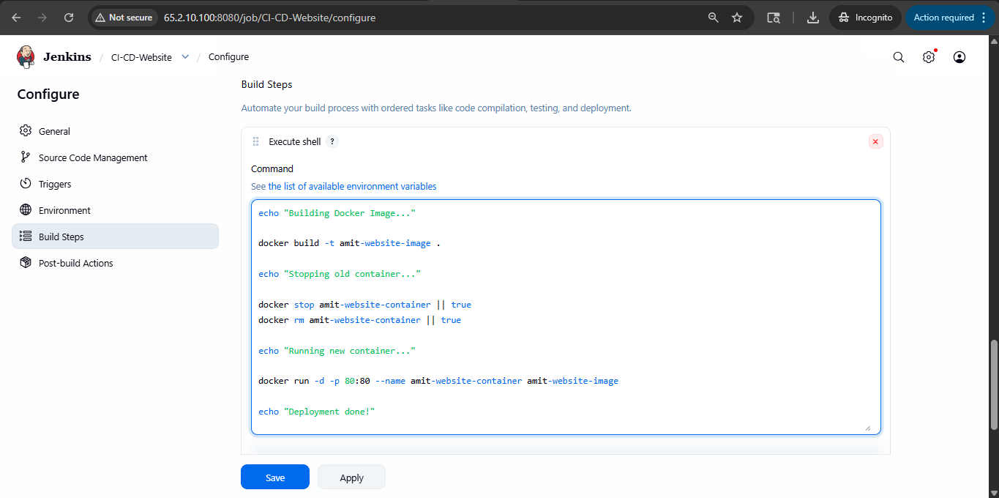
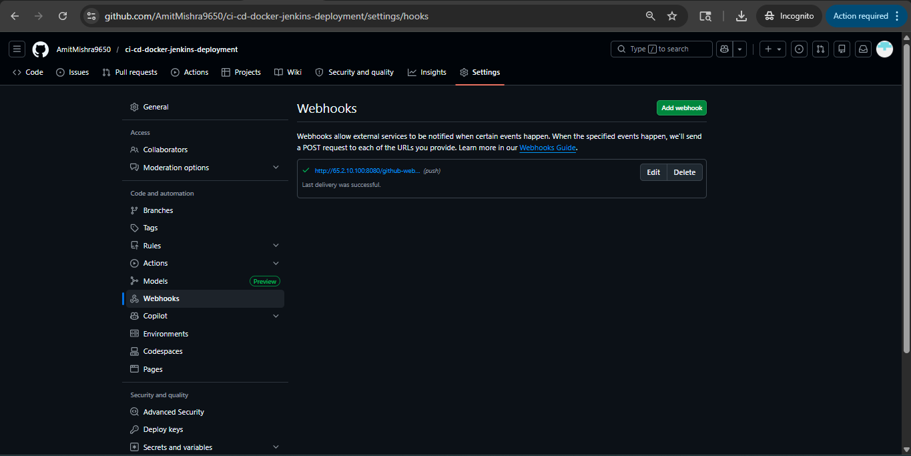
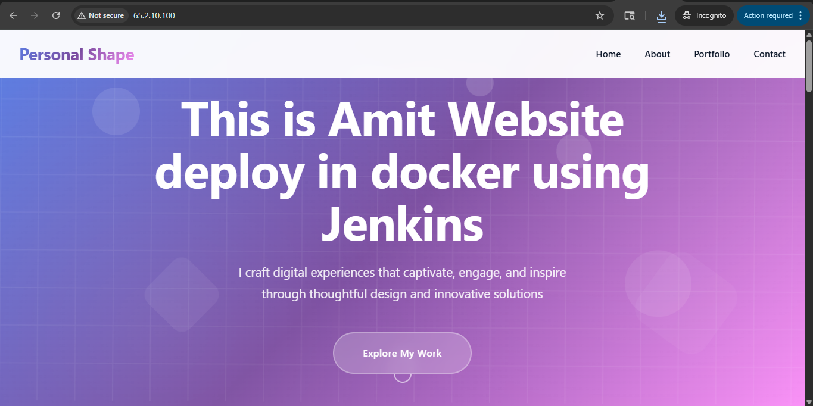

#  CI/CD Pipeline with Docker & Jenkins on AWS EC2

This project demonstrates a complete CI/CD pipeline using Jenkins, Docker, GitHub, and AWS EC2.  
Whenever code is pushed to GitHub, Jenkins automatically builds a Docker image, deploys a container, and updates the live website automatically.

---

#  Tech Stack

- AWS EC2 (Ubuntu Server)
- Jenkins (CI/CD Automation)
- Docker (Containerization)
- Git & GitHub (Version Control)
- HTML/CSS Website
- Linux

---

#  Architecture Flow

GitHub Repository → Jenkins Webhook Trigger → Docker Build → Container Deployment → AWS EC2 → Live Website

---

#  Step 1: Create AWS EC2 Instance

- Launch Ubuntu EC2 instance
- Configure Security Group:
  - Port 22 → SSH
  - Port 8080 → Jenkins
  - Port 80 → Website

---

#  Step 2: Install Docker

Bash 

sudo apt update -y
sudo apt upgrade -y
sudo apt install docker.io -y

#  Step 3: Install Jenkins

## Install Java

Bash 

sudo apt update
sudo apt install fontconfig openjdk-21-jre -y
java -version

## Install Jenkins

Bash 

sudo wget -O /etc/apt/keyrings/jenkins-keyring.asc \
https://pkg.jenkins.io/debian-stable/jenkins.io-2026.key

echo "deb [signed-by=/etc/apt/keyrings/jenkins-keyring.asc] \
https://pkg.jenkins.io/debian-stable binary/" | sudo tee \
/etc/apt/sources.list.d/jenkins.list > /dev/null

sudo apt update
sudo apt install jenkins -y

#  Step 4: Configure Services

Bash 

* sudo usermod -aG docker jenkins
* sudo systemctl restart jenkins
* sudo systemctl restart docker

#  Step 5: Access Jenkins

Open browser:

http://EC2-PUBLIC-IP:8080

Get Jenkins admin password:

Bash 

sudo cat /var/lib/jenkins/secrets/initialAdminPassword

#  Step 6: Jenkins Initial Setup

- Install Suggested Plugins
- Create Admin User

Example:
- Username: admin
- Password: admin@321

#  Step 7: Create Jenkins Job

- Create New Item
- Freestyle Project → CI-CD-Website

## Source Code Management
- Select Git

Repository URL:

https://github.com/AmitMishra9650/ci-cd-docker-jenkins-deployment.git

- Add GitHub Credentials

   username: AmitMishra9650
   Token : "*******"
    
- Branch: main

Enable:

-  GitHub hook trigger for GITScm polling

#  Step 8: Build Step (Execute Shell)

echo "Building Docker Image..."

* docker build -t amit-website-image .

echo "Stopping old container..."

* docker stop amit-website-container || true
* docker rm amit-website-container || true

echo "Running new container..."

* docker run -d -p 80:80 --name amit-website-container amit-website-image

echo "Deployment Completed Successfully!"

#  Step 9: Build Project

- Click **Build Now**
- Verify running container:

Bash

* docker ps ( EC2 Instance )
* 

## For Automation , Git push > BUild > Deploy in Docker container > Website running 

 Step 10: Configure GitHub Webhook

## Install Jenkins Plugin
- GitHub Integration Plugin

## Add Webhook in GitHub

GitHub Repository → Settings → Webhooks → Add Webhook

Payload URL:

http://EC2-PUBLIC-IP:8080/github-webhook/     # jenkins URl 

Content Type:

application/json

Now whenever code changes are pushed to GitHub, Jenkins automatically triggers deployment.

---

#  Application Output

Open browser:

http://EC2-PUBLIC-IP

#  Project Screenshots
=========================

##  Jenkins Dashboard

##  Docker Container Running

##  Live Website Output

##  Changes in Index.html 

##  EC2-SG

##  Ec2

##  Execute Shell

##  Webhooks

##  Website Output after Trigger Webhook

#  Project Structure

ci-cd-docker-jenkins-deployment/
├── Console Output Build-1.txt
├── Console Output Build-2.txt
├── Dockerfile
├── README.md
├── index.html
├── templatemo-personal-javascripts.js
├── templatemo-personal-style

├── screenshots/
│   ├── jenkins-dashboard.png
│   ├── docker-container.png
│   └── website-output.png
    └── Changes-in-Index.html-file.png
    └── EC2-SG.png
    └── EC2.png
    └── Execute-Shell.png
    └── Webhooks.png
    └── Website-Output-after-Trigger-Webhook.png
   
└── images /
    └── computer-desk-stickers
    └── curved-display-pinky-girl
    └── dashboard-interfaces-transparent-displays
    └── marketing-strategy-women
    └── portfolio-website-girl
    └── smiling-girl-computer-desktop
    └── working-business-women
     
    
     
#  Key Features

- Automated CI/CD pipeline
- Docker container deployment
- Jenkins webhook integration
- AWS EC2 hosting
- Automatic deployment on every GitHub push

---

#  Author

## Amit Mishra
